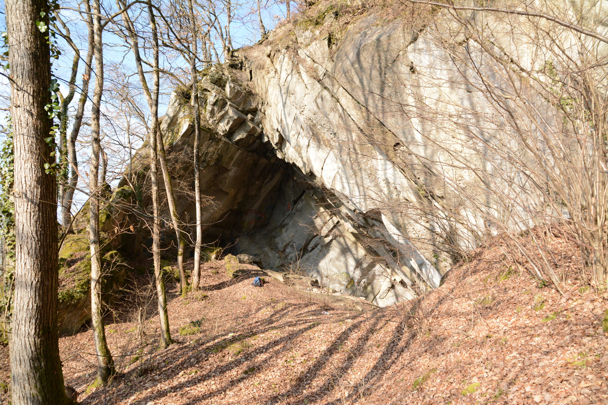
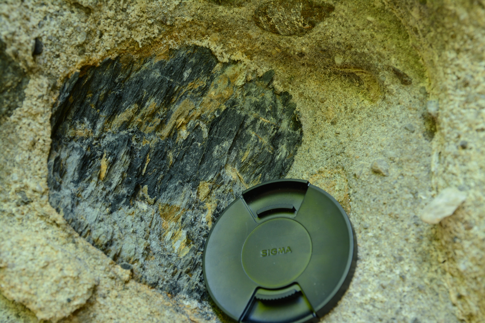
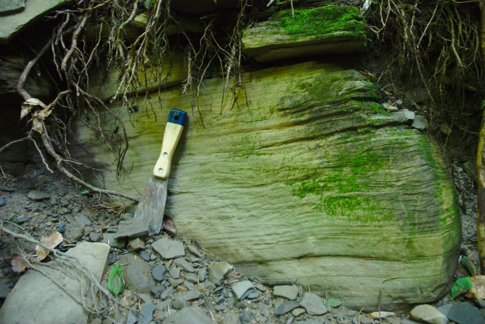
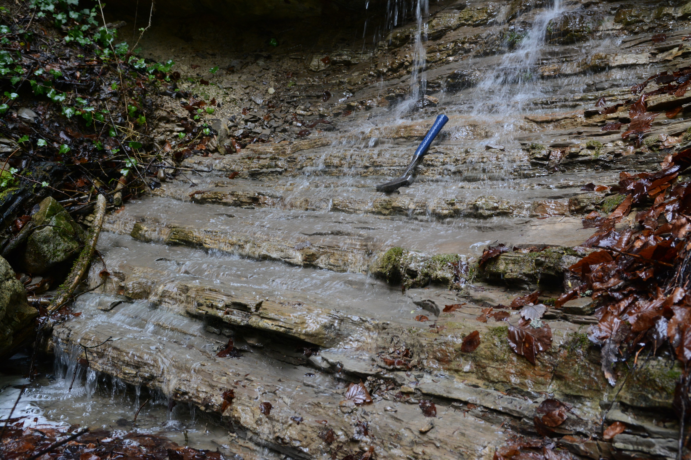

<link rel="stylesheet" href="styles.css" type="text/css">

<figure>
  
  <figcaption>Panorama of the Voirons (left), the Môle and the Mont-Blanc (middle) and Bornes massif (right)</figcaption>
</figure>
 

## Geological settings

The Alps result from the convergence of the European and the African plates, and the subsequent closure of the Alpine Tethys during Cretaceous-Tertiary times (Schmid et al., 1996; Handy et al., 2010). The mountain chain comprises several low-elevation reliefs, such as the Chablais massif (or Chablais Prealps) and the Swiss Prealps, which are located between the Lake Geneva and Lake Thun, straddling France and Switzerland. These massif correspond to the former accretionary prism in the Western to Central Alps. They consists of a stack of sedimentary cover nappes (Caron, 1973; Caron et al., 1989) including, in ascending order, units originating from the European margin (Ultrahelvetic realm), the Valais Ocean, the Briançonnnais micro-continent and the Piemont Ocean. The nappes were detached from their basement during the subduction of the Alpine Tethys, following a thin-skinned, in-sequence thrusting (Mosar, 1991; Wissing and Pfiffner, 2002). Nowadays, the Chablais massif overlies the Helvetic nappes to the SE and the North Alpine Foreland Basin to the NW. 

Located along the outer edge of the Chablais massif, the Voirons-Wägital complex, formely called Gurnigel nappe (Caron, 1976), is one of the lowermost Prealpine units. This nappe extends throughout the Swiss Prealps to Lake Zurich to the NE. It corresponds to a detrital accumulation generally interpreted as deep-sea gravity-flow deposits (i.e. a flysch; Kuenen and Carozzi, 1953; Frébourg, 2006) based on the Rhabdamina fauna found in some marly intervals (Brouwner, 1965; Weidmann, 1967; Van Stuijvenberg et al., 1976; Ujetz, 1996) and the ichnofacies associations (Crimes et al., 1981). Recurrent plant fragments observed on top of many beds suggest deposition by extrabasinal gravity flows (e.g. hyperpycnal flows; Zavala and Arcuri, 2016). Detrital sediments originate from the southern margin of the Alpine Tethys (Winkler, 1984; Caron et al., 1989; Bütler et al., 2011).

## Problematic

The exact palaeogeographic location of the Voirons-Wägital complex remains controversial. For long, the flysch units outcropping along the NW
edge of the Prealps were thought to originate from the Ultrahelvetic realm (e.g. Tercier 1928; Lombard 1940), but several authors had already noticed the petrographical resemblance of some conglomerate clasts found in these units (e.g. pink granite fragments) with several rock bodies exposed in the Southern Alps (Sarasin 1894; Pilloud 1936; Lombard 1940; Cogulu 1961) such as the Bernina nappe, Canavese zone, Err-Albula granite and Falknis nappe. Later, based on petrographic and biostratigraphic data, Caron (1976) regrouped all these flyschs in a new tectonic unit, the Gurnigel nappe, which is correlated with the Sarine nappe (Upper Prealps nappe) of South Penninic origin. Detrital grains were thought to originate from the Austro-alpine domain (Winkler 1983; Caron
et al. 1989). The peculiar structural position of the Voirons-Wägital complex at the base of the Prealps nappe stack was then explained by the overthrusting of the Upper Prealps nappes beyond the front of the Préalpes Médianes nappe, followed by out-of-sequence thrusting of the latter (Mosar 1991; Wissing and Pfiffner 2002). However, recent structural data from the Iberg Klippe (Trümpy 2006) and the younger age found by Ujetz (1996), Ospina-Ostios et al. (2013) and Ospina-Ostios (2017) now suggest that the Voirons-Wägital complex could have been deposited in the Valais domain, which would considerably simplify the kinematics of the Prealps.

## Aims

The primary goal of my PhD thesis was to describe the source of the detrital sediments using the framework composition and heavy mineral assemblages. Results will be help to better constrain the palaeogeographic location of the Voirons-Wägital complex. Coupled with grain-size measurements on thin-section, results aims to define the compositional evolution of the density flow from proximal to basinal parts. Extensive field-trip prospect also helped to further described the overall stratigraphy and tectonic of the Voirons Flysch with the production of about 30 stratigraphic logs.

## Results

### Provenance analysis

Sediments encompass a quartzo-felspathic composition with a secondary lithic content. The latter group comprise a great diversity of lithology including carbonates, granite, metamorhpic rock-fragment and few andesitic rock-fragments. The heavy mineral assemblage are dominated by ultrastable (ZTR group) to stable species (apatite and garnet). Unstable grains are scarce. 
Framework composition and heavy mineral populations describe two major detrital groups. The **Quartzose petrofacies** comprise a quartz-dominated composition with addition of frequent intrabasinal wackestone fragments. Rock-fragments are characterised by the occurence of pink granites, well spreaded in the Voirons-Wägital complex. The **Feldspathic petrofacies** is a feldspar-dominated sediment with a large amount of metamorphic inputs. The latter is also highlighted by the greater concentration of garnet. Diagnostic pebbles are black Paleozoic sandstones probably inherited to the Zone Houillère. Pink grainte are in contrast rare.

<!-- ### Grain-size and lithofacies -->

<!-- The correlation of the modal composition with the grain-size distribution emphasises a proximal to basinal compositional trend. A statistical analysis describe 6 lithofacies. **L1**-**L2** correspond to channel deposits with a greater amount of extrabasinal, low cementation, large porosity and the lack of bioclasts. **L3**-**L5** lithofcies show the development of cementation at the expense of the porosity. The bioclast content increases with first the deposition of large benthic foraminifers and then planktonic foraminifers. Finally, glauconite-rich sandstones (**L6**) represent a reworked turbitic deposits by bottom current or the tail of density current. Their quartzose composition indicate the extensive reworking of the light fraction (e.g. bioclasts) by the current. -->

### Stratigraphy

The creation of more than 30 stratigraphic logs help to better defined the overall stratigraphy of the Voirons Flysch. The Voirons Flysch is now subdivided into four formations (Ragusa, 2015:

#### The Voirons Sandstone Fm.

<figure>
  
  
  
</figure>

**The Voirons Sandstone Fm.** is a sandstone-rich succession with a variable amount of intercalated marls. The basal part is dominated by marls with subordinate, cm- thick sandstone beds (**Bons Sandstone Mb.**). Beds show recurring Bouma Tb-Te sequences. The remainder of the formation is dominated cm- to m-thick sandstone beds and marly intervals do not exceed a few cm in thickness. The base of the sandstone beds is commonly sharp, non-erosive, and sometimes bioturbated (Lombard, 1940). Some beds show rip-up clasts or mud-molds horizons. Isolated conglomerate layers occur along the Voirons crest (**Crest conglomerates beds**). They are matrix-supported except for one clast-supported conglomerate. The **Allinges Sandstone Mb.** is a lateral variation concentrated along the Allinge Hill. The lithostratigraphy describes a stack of caorse sandstone with rare marly intervals. Initially considered as deltaic sediments (Lombard, 1940), the Voirons Sandstone Fm. is nowadays interpreted as channel and lobe deposits in a deep-sea fan (Ospina-Ostios et al., 2013; Ragusa, 2015). The boundary with the overlying Vouan Conglomerate Fm. is transitional (interfingering).

#### Vouan Conglomerate Fm.

<figure>
  
  
</figure>

The **Vouan Conglomerate Fm.** mostly includes pebbly sandstones and poorly sorted, matrix-supported, conglomerates with a sandy matrix. Pebbles, cobbles and blocks are randomly distributed within the sandy matrix or constitute well defined horizons. The Vouan Conglomerate Fm. is mostly devoid of marly intervals. Marls usually occur as dm-sized soft pebbles. The dm- to m-thick conglomeratic beds have a limited lateral extent, and locally present a typical channel morphology. The Vouan Conglomerate Fm. thus is interpreted as channel deposits (Frébourg, 2006; Ospina-Ostios et al., 2013; Ragusa, 2015). The boundary between the Vouan Conglomerate Fm. and the overlying Boëge Marl Fm. is sharp.

#### Boëge Marl Fm.

<figure>
  
  
</figure>

The **Boëge Marl Fm.** is a marl-rich succession comprising rare, cm- thick sandstone beds. The latter commonly show partial (Tb-Te) Bouma sequences. The base of the formation locally includes dm-thick, matrix-supported conglomeratic layers, probably resulting from the collapse of the Vouan Conglomerate Fm. channels from upstream parts (Ragusa, 2015). The Boëge Marl Fm. is interpreted as distal lobe deposits (Ospina-Ostios et al., 2013; Ragusa, 2015). The sand-marl ratio progressively increases upward to the overlying Bruant Sandstone Fm.

#### Bruant Sandstone Fm.

The **Bruant Sandstone Fm.** (Ragusa, 2015) is lithologically similar to the Voirons Sandstone Fm. This unit only occurs in the Grande Combe – Tête de Char area. It was previously considered as a mélange (Kerrien et al., 1998) because of the important tectonic deformation near the boundary with the overlying Préalpes Médianes nappe. As the Voirons Sandstone Fm., the Bruant Sandstone Fm. is interpreted as channel to lobe deposits (Ragusa, 2015).

## Associated publications

**Ragusa J**, Ospina-Ostios LM, Spezzaferri S, Kindler P (**2018**). Revision of the planktonic foraminiferal biostratigraphy of the Voirons flysch (Chablais Prealps, Haute-Savoie, France). *Swiss Journal of Geosciences*, doi: [10.1007/s00015-018-0314-7](https://link.springer.com/article/10.1007%2Fs00015-018-0314-7).

**Ragusa J**, Kindler P, Segvic B, Ospina-Ostios LM (**2017**). Provenance analysis of the Voirons Flysch (Gurnigel nappe, Haute-Savoie, France): Stratigraphic and paleogeographic implications. *International Journal of Earth Sciences*, 106(8):2619–2651, doi: [10.1007/s00531-017-1474-9](http://link.springer.com/article/10.1007%2Fs00531-017-1474-9)

Ospina-Ostios LM, **Ragusa J**, Wernli R, Kindler P (**2013**). Planktonic foraminifera biostratigraphy as a tool in constraining the timing of flysch deposition: Gurnigel flysch, Voirons massif (Haute-Savoie, France). *Sedimentology*, 60:225–238, doi: [10.1111/sed.12013](http://onlinelibrary.wiley.com/doi/10.1111/sed.12013/abstract;jsessionid=5A54433B3561A853F6DBF83958E6C356.f03t03)

**Ragusa J**, Kindler P. Compositional variations in deep-sea gravity-flow deposits. A case study from the Voirons Flysch (Voirons-Wägital complex, Chablais Prealps, France) (**in review**). *Sedimentary Geology*.
