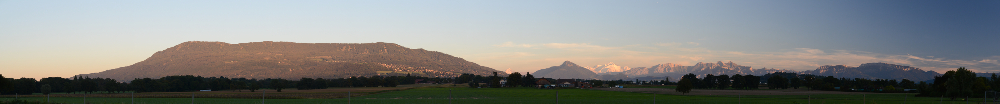
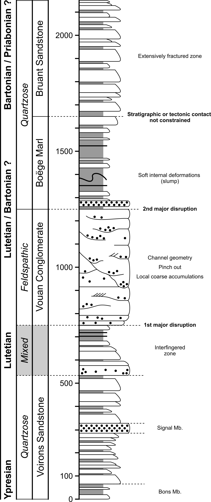
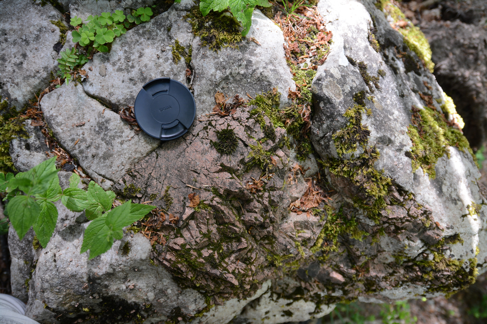

<link rel="stylesheet" href="styles.css" type="text/css">

<figure>
  
  <figcaption>Panorama of the Voirons (left), the Môle and the Mont-Blanc (middle) and Bornes massif (right)</figcaption>
</figure>
<br>

# Geological settings

The Alps result from the convergence of the European and the African plates, and the subsequent closure of the Alpine Tethys during Cretaceous-Cenozoic times (Schmid et al., 1996; Handy et al., 2010). The mountain chain comprises several low-elevation reliefs, such as the Chablais massif (or Chablais Prealps) and the Swiss Prealps, which are located between the Léman (Lake Geneva) and Lake Thun, straddling France and Switzerland. These massif correspond to the first fold-and-thrust belt in the Western to Central Alps. They consists of a stack of sedimentary cover nappes (Caron, 1973; Caron et al., 1989) including, in ascending order, units originating from the European margin (Ultrahelvetic realm), the Valais through, the Briançonnnais microcontinent and the Piemont Ocean. The nappes were detached from their basement during the subduction of the Alpine Tethys, following a thin-skinned, in-sequence thrusting (Mosar, 1991; Wissing and Pfiffner, 2002). Nowadays, the Chablais massif overlies the Helvetic nappes to the SE and the North Alpine Foreland Basin to the NW.<br>


Located along the outer edge of the Chablais massif, the formerly called Gurnigel nappe sensu Caron (1976), is one of the lowermost Prealpine units. This nappe is now subdivided into four discrete nappes which are from west to east: the Voirons nappe, the Gurnigel nappe, the Schlieren nappe and the Wägital nappe. Each unit is defined as a nappe (e.g. the Voirons nappe) from a tectonic point of view, and as a flysch (e.g. the Voirons flysch) when considered as a stratigraphic unit. Although these units share similar lithostratigraphic and petrographic characteristics, and range in age from the Campanian to the late Eocene (van Stuijvenberg 1979; Winkler 1984a; Caron et al. 1989; Ragusa
et al. 2018), these correlations are taken for granted, although there is currently no consensus on the relationship of the different flyschs. They corresponds to detrital accumulations generally interpreted as deep-sea gravity-flow deposits (Kuenen and Carozzi, 1953; Frébourg, 2006) based on the Rhabdamina fauna found in marly intervals (Brouwner, 1965; Weidmann, 1967; Van Stuijvenberg et al., 1976; Ujetz, 1996) and the ichnofacies associations (Crimes et al., 1981). Recurrent plant fragments observed on top of many beds suggest deposition by extrabasinal gravity flows (e.g. hyperpycnal flows; Zavala and Arcuri, 2016). 

```{r include = FALSE}
library(leaflet)

outcrops <- read.csv("/home/jeremy/UniGE/Git/VoironsFlysch/data/outcrops.csv", header = TRUE, comment.char = "#", stringsAsFactors = FALSE)

pal <- colorFactor(c("#FF9130", "#FEDD55", "#9C9C9B", "#3B0030", "#3B0030", "#F53A33"), domain = c("Voirons Sandstone", "Vouan Conglomerate", "Boëge Marl", "Bruant Sandstone", "Voirons Sandstone - Vouan Conglomerate", "Gurnigel"))
```

```{r echo = FALSE, message = FALSE, warning = FALSE}
outcrops %>% 
  leaflet(width = "100%") %>%
  setView(lng = 6.7055, lat = 46.2634, zoom = 10) %>% 
  addTiles() %>%
  addCircleMarkers(
    radius = 5,
    color = ~pal(formation),
    stroke = FALSE, 
    fillOpacity = 0.9,
    popup = paste("<strong>", "Name:", "</strong>", outcrops$name_en, "<br>",
                  # "<strong>", "Nom:", "</strong>", outcrops$name_fr, "<br>",
                  "<strong>", "Formation:", "</strong>", outcrops$formation, "<br>",
                  "<strong>", "Member:", "</strong>", outcrops$member, "<br>",
                  "<strong>", "Status:", "</strong>", outcrops$status, "<br>",
                  "<strong>", "Type:", "</strong>", outcrops$type, "<br>",
                  "<strong>", "Comment:", "</strong>", outcrops$comments)) %>%
  addLegend("topright", 
            colors= c("#FEDD55", "#FF9130", "#F53A33", "#3B0030"), 
            labels=c("Bruant Sandstone", "Boëge Marl", "Vouan Conglomerate", "Voirons Sandstone"), 
            opacity = 1,
            title="Voirons Flysch") %>% 
  addLegend("topright", 
            colors= c("#9C9C9B"), 
            labels=c("Gurnigel Flysch"), 
            title="Others Flysch") %>% 
  addMiniMap()
```

# Problematic

The palaeogeographic origin of the Gurnigel nappe sensu Caron (1976) remains controversial. For long, the flysch units outcropping along the NW edge of the Prealps were thought to originate from the Ultrahelvetic realm (e.g. Tercier 1928; Lombard 1940), but several authors had already noticed the petrographical resemblance of some conglomerate clasts found in these units (e.g. pink granite fragments) with several rock bodies exposed in the Southern Alps (Sarasin 1894; Pilloud 1936; Lombard 1940; Cogulu 1961) such as the Bernina nappe, Canavese zone, Err-Albula granite and Falknis nappe. Later, based on petrographic and biostratigraphic data, Caron (1976) regrouped all these flyschs in a new tectonic unit, the Gurnigel nappe, which is correlated with the Sarine nappe (Upper Prealps nappes) of South Penninic origin. Detrital grains were thought to originate from the Austro-alpine domain (Winkler 1983; Caron et al. 1989). The peculiar structural position of the former Gurnigel nappe at the base of the Prealps nappe stack was then explained by the overthrusting of the Upper Prealps nappes beyond the front of the Préalpes Médianes nappe, followed by an out-of-sequence thrusting of the latter (Mosar 1991; Wissing and Pfiffner 2002). However, recent structural data from the Iberg Klippe (Trümpy 2006) and the younger age found by recent studies in the Voirons flysch (Ujetz, 1996; Ospina-Ostios et al., 2013; Ospina-Ostios, 2017; Ragusa et al., 2018) now suggest that the Voirons flysch could have been deposited in the Valais domain (Schmid et al., 2005; Ragusa et al., 2017), which would considerably simplify the kinematics of the Prealps.

# Aims

The primary goal of my PhD thesis was to describe the source of the detrital sediments using the framework composition and heavy mineral assemblages. Results help to better constrain the palaeogeographic location of the Voirons flysch. Coupled with grain-size measurements on thin-section, results aims to define the compositional evolution of the density flow from proximal to basinal parts. Extensive field-trip prospect also helped to further described the overall stratigraphy and tectonic of the Voirons flysch with the production of about 30 stratigraphic logs.

# Results

## Provenance analysis

Sediments encompass a quartzo-felspathic composition with a secondary lithic content. The latter group comprise a great diversity of lithology including carbonates, granite, metamorhpic rock-fragment and few andesitic rock-fragments. The heavy mineral assemblage are dominated by ultrastable (ZTR group) to stable species (apatite and garnet). Unstable grains are scarce.<br>
Framework composition and heavy mineral populations describe two major detrital groups. The **Quartzose petrofacies** comprise a quartz-dominated composition with addition of frequent intrabasinal wackestone fragments. Rock-fragments are characterised by the occurence of pink granites, well spreaded in the Voirons flysch. The **Feldspathic petrofacies** is a feldspar-dominated sediment with a large amount of metamorphic inputs. The latter is also highlighted by the greater concentration of garnet. Diagnostic pebbles are black Paleozoic sandstones probably inherited to the Zone Houillère. Pink grainte are in contrast rare.


## Grain-size and lithofacies

The correlation of the modal composition with the grain-size distribution emphasises a proximal to basinal compositional trend. A statistical analysis describe 6 lithofacies. **L1**-**L2** correspond to channel deposits with a greater amount of extrabasinal, low cementation, large porosity and the lack of bioclasts. **L3**-**L5** lithofcies show the development of cementation at the expense of the porosity. The bioclast content increases with first the deposition of large benthic foraminifers and then planktonic foraminifers. Finally, glauconite-rich sandstones (**L6**) represent a reworked turbitic deposits by bottom current or the tail of density current. Their quartzose composition indicate the extensive reworking of the light fraction (e.g. bioclasts) by the current.


Brought back to the framework of provenance analysis, the lithofacies distribution shows that two factors control the sample distribution. The major one, the provenance (allogenic factor), identified from the quartz:feldspar ratio, distinguishes two major detrital groups which are organised following the weathering trend of the Continental Block domain, whereas the grain-size, and the depositional settings through the lithofacies, defines the sample distribution within each provenance along a channel-lobe axis (or an upstream-downstream trend). These results suggest that it is important to analyse the whole deep-sea fan to capture the entire detrital signature. Hence, comparisons between several deep-sea fans can only be made between entire similar depositional settings.


## Biostratigraphy

Initial attempts to date the Voirons Flysch were based on larger benthic foraminifera (Pilloud 1936; Lombard 1940; Schaub 1951; Rigassi 1958; Cogulu 1961) which constrain the Voirons Flysch between the Thanetian (Paleocene) and the Lutetian (Eocene). However, these organisms are mostly reworked from neighbouring carbonate platforms where they thrived during the Palaeogene (Scheibner and Speijer 2008). Calcareous nannofossils provided the first accurate biostratigraphic determinations (Jan du Chêne and Gorin, 1974; Jan du Chêne and Chateauneuf, 1975; Jan du Chêne et al. 1975; van Stuijvenberg 1980). They provided the first complete biostratigraphic description of the stratigraphy of the Voirons Flysch and lead to the description of the Boëge Marl (Van Stuijvenberg and Jan du Chêne, 1980) as the younger unit of the Voirons Flysch. The Voirons Flysch is then dated between the Thanetian and the Bartonian(Eocene). More recently, planktonic foraminifera biostratigraphy was also applied in the Voirons Flysch (Ujetz 1996; Frébourg 2006; Ospina-Ostios et al. 2013; Ospina-Ostios 2017). Initial biostratigraphic of planktonic foraminifers studies rejuvenated the flysch between the Middle Eocene and Early Oligocene (Ospina et al., 2013). Results corroborated the conclusion of Trümpy (2006) ascribing a Valais palaeogeographic origin. However, a biostratigraphic revision (Ragusa et al., 2018) reveals minor discrepancies with nannofossil biostratigraphy and constrain age between the Ypresian and the Bartonian but the youngest age are not defined and could extent to the Priabonian.


## Stratigraphy

The creation of more than 30 stratigraphic logs improves the description of the overall stratigraphy of the Voirons flysch which is henceforth subdivided into three stratigraphic units at the formation level and an uncertain unit (Ragusa, 2015; Ragusa et al., 2021):

<figure>
  
  
</figure>

The revision resolves some uncertainties of attribution (Allinges hills) and refines some contacts (Upper Saxel quarry belongs now to the Vouan Conglomerate). Reference sections are also defined.

### Voirons Sandstone

<figure>
  
  
</figure>

**The Voirons Sandstone** is a sandstone-rich succession with a variable amount of intercalated marls. The basal part is dominated by marls with subordinate, cm- thick sandstone beds (**Bons Mb.**). Beds show recurring Bouma Tb-Te sequences. The remainder of the formation is dominated cm- to m-thick sandstone beds and marly intervals do not exceed a few cm in thickness. The base of the sandstone beds is commonly sharp, non-erosive, and sometimes bioturbated (Lombard, 1940). Some beds show rip-up clasts or mud-molds horizons. Isolated conglomerate layers occur along the Voirons crest (**Signal Mb.**). They are matrix-supported except for one clast-supported conglomerate. The **Allinges Mb.** is a lateral variation concentrated along the Allinge Hill. The lithostratigraphy describes a stack of caorse sandstone with rare marly intervals. Initially considered as deltaic sediments (Lombard, 1940), the Voirons Sandstone is nowadays interpreted as channel and lobe deposits in a deep-sea fan (Ospina-Ostios et al., 2013; Ragusa, 2015). The boundary with the overlying Vouan Conglomerate is transitional (interfingering).

### Vouan Conglomerate

<figure>
  
  
  
</figure>

The **Vouan Conglomerate** mostly includes pebbly sandstones and poorly sorted, matrix-supported, conglomerates with a sandy matrix. Pebbles, cobbles and blocks are randomly distributed within the sandy matrix or constitute well defined horizons. The Vouan Conglomerate is mostly devoid of marly intervals. Marls usually occur as dm-sized soft pebbles. The dm- to m-thick conglomeratic beds have a limited lateral extent, and locally present a typical channel morphology. The Vouan Conglomerate thus is interpreted as channel deposits (Frébourg, 2006; Ospina-Ostios et al., 2013; Ragusa, 2015). The boundary between the Vouan Conglomerate and the overlying Boëge Marl is sharp.

### Boëge Marl

<figure>
  
  
</figure>

The **Boëge Marl** is a marl-rich succession comprising rare, cm- thick sandstone beds. The latter commonly show partial (Tb-Te) Bouma sequences. The base of the formation locally includes dm-thick, matrix-supported conglomeratic layers, probably resulting from the collapse of the Vouan Conglomerate channels from upstream parts (Ragusa, 2015). The Boëge Marl is interpreted as distal lobe deposits (Ospina-Ostios et al., 2013; Ragusa, 2015). The sand-marl ratio progressively increases upward to the overlying Bruant Sandstone.

### Bruant Sandstone

The **Bruant Sandstone** (Ragusa, 2015) is lithologically similar to the Voirons Sandstone. This unit only occurs in the Grande Combe – Tête de Char area. It was previously considered as a mélange (Kerrien et al., 1998) because of the important tectonic deformation near the boundary with the overlying Préalpes Médianes nappe. As the Voirons Sandstone, the Bruant Sandstone is interpreted as channel to lobe deposits (Ragusa, 2015).

# Associated publications

**Ragusa J**, Ospina-Ostios LM, Kindler P, Sartori M (**2021**). Stratigraphic revision and reconstruction of the deep-sea fan of the Voirons Flysch (Voirons Nappe, Chablais Prealps). *Swiss Journal of Geosciences*, 114, doi: 10.1186/s00015-020-00383-1.

**Ragusa J**, Kindler P (**2018**). Compositional variations in deep-sea gravity-flow deposits. A case study from the Voirons Flysch (Voirons-Wägital complex, Chablais Prealps, France). *Sedimentary Geology*, 377:111-130, doi: [10.1016/j.sedgeo.2018.08.010](https://www.sciencedirect.com/science/article/pii/S0037073818302033) [[PDF](files/Ragusa2018b.pdf)].

**Ragusa J**, Ospina-Ostios LM, Spezzaferri S, Kindler P (**2018**). Revision of the planktonic foraminiferal biostratigraphy of the Voirons Flysch (Chablais Prealps, Haute-Savoie, France). *Swiss Journal of Geosciences*, 111:433–445, doi: [10.1007/s00015-018-0314-7](https://link.springer.com/article/10.1007%2Fs00015-018-0314-7) [[PDF](files/Ragusa2018a.pdf)].

**Ragusa J**, Kindler P, Segvic B, Ospina-Ostios LM (**2017**). Provenance analysis of the Voirons Flysch (Gurnigel nappe, Haute-Savoie, France): Stratigraphic and paleogeographic implications. *International Journal of Earth Sciences*, 106(8):2619–2651, doi: [10.1007/s00531-017-1474-9](http://link.springer.com/article/10.1007%2Fs00531-017-1474-9) [[PDF](files/Ragusa2017a.pdf)].

Ospina-Ostios LM, **Ragusa J**, Wernli R, Kindler P (**2013**). Planktonic foraminifera biostratigraphy as a tool in constraining the timing of flysch deposition: Gurnigel flysch, Voirons massif (Haute-Savoie, France). *Sedimentology*, 60:225–238, doi: [10.1111/sed.12013](http://onlinelibrary.wiley.com/doi/10.1111/sed.12013/abstract;jsessionid=5A54433B3561A853F6DBF83958E6C356.f03t03) [[PDF](files/Ospina-Ostios2013.pdf)].
